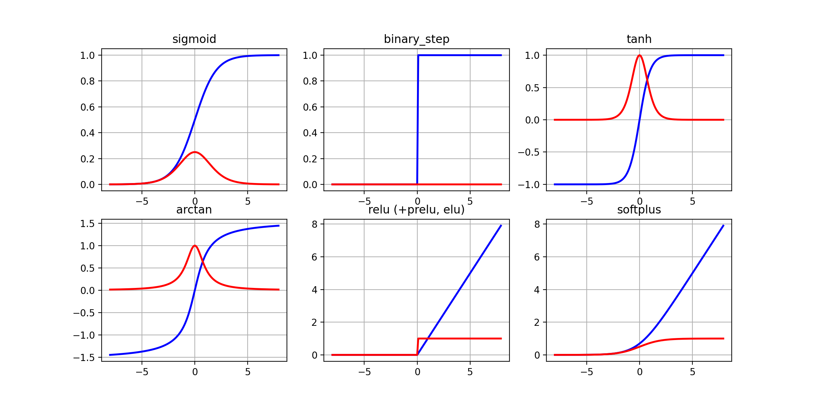

<p align="center">
    
</p>

# ⚡ Positron

[](https://github.com/MartinKondor/positron/)
[](https://github.com/MartinKondor/positron)
[](https://github.com/MartinKondor/positron/issues)

[](https://opensource.org/licenses/BSD)

Blazingly fast Deep Learning library for Python.

The main focuses of Positron are
* Speed
* Functionality
* Scalability
* Understandability

_There is a [Medium Article](https://martinkondor.medium.com/positron-linear-algebra-library-for-python-8a3c5c3e1c00) written about this library, make sure to check it out!_

## Features

| File      | Description |
| --------- | ----------- |
| **example.py**      | **A simple neural network adaptation** working with this library.       |
| **deep.py**      | **Deep Learning** learning related functions: feedforward, backprop etc.       |
| **activ.py**      | Common Deep Learning **Activation Functions**.       |
| **maths.py**      | **Matrix operations**: inverse, determinant, adjungate etc.       |
| **prep.py**      | **Data Preprocessing Functions**: time stamp to date, date to time stamp etc.        |
| **score.py**     | **Scoring/loss/cost Functions** and their derivatives: residual sum of squares, mean absolute error etc.        |

## Getting Started

### Prerequisites

* Python 3.8+
* Anaconda 4.9.2+ (optional)
* Python modules from the [requirements.txt](./requirements.txt) file

### Dependencies

For the dependencies, see the contents of the [requirements.txt](./requirements.txt) file, also let's note here that:

*This library should and never will depend on an other ML/DL library (like **keras**, **tensorflow** etc.), not even on **scikit-learn**.*

## Tests

To run tests on a file, run the file directly, for example:

```$ python positron/math.py```

## Contributing

This project is open for any kind of contribution from anyone.

### Steps

1. Fork this repository
2. Create a new branch (optional)
3. Clone it
4. Make your changes
5. Upload them
(5+1). Make a pull request here

## Authors

* **[Martin Kondor](https://github.com/MartinKondor)**

## License 

Copyright &copy; 2022 Martin Kondor.

See the [LICENSE](./LICENSE) file for details.
